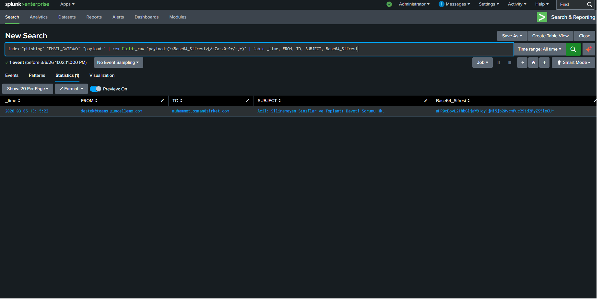
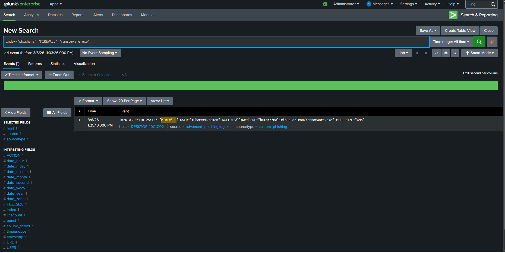

# End-to-End Incident Response: Spear Phishing & Ransomware Infection
*Turkish translation is available below / Türkçe çevirisi aşağıdadır.*

## 🇬🇧 English - Objective
The objective of this lab is to conduct a complete **Incident Response (IR)** lifecycle on a sophisticated Spear Phishing attack. The scenario involves a socially engineered email targeting a specific user with a hidden, Base64-encoded malicious payload. The investigation goes beyond simply identifying the malicious email; it correlates **Email Gateway** logs with **Firewall** traffic to definitively prove system compromise (infection).

### Phase 1: Triage & Payload Extraction (Email Gateway)
During routine log triage, a suspicious email masquerading as an urgent Microsoft Teams update was detected. The embedded URL contained a suspicious parameter. Using Splunk's SPL (`rex` command), I dynamically extracted the Base64 encoded payload from the raw logs for analysis.
* **SPL Query:** `index="phishing" "EMAIL_GATEWAY" "payload=" | rex field=_raw "payload=(?<Base64_Sifresi>[A-Za-z0-9+/=]+)" | table _time, FROM, TO, SUBJECT, Base64_Sifresi`
* **Decoding Analysis:** Decoding the extracted Base64 string (`aHR0cDovL21hbGljaW91cy1jMi5jb20vcmFuc29td2FyZS5leGU=`) revealed the true malicious intent: `http://malicious-c2.com/ransomware.exe`

### Phase 2: Infection Verification (Firewall Correlation)
Identifying a phishing email is only half the battle. To determine if the user fell victim to the attack, I pivoted to the network **Firewall logs**. By querying the decoded malicious URL, I discovered that the user clicked the link and the firewall permitted (`ACTION=Allowed`) the download of the 4MB ransomware executable, confirming a full endpoint compromise.
* **SPL Query:** `index="phishing" "FIREWALL" "ransomware.exe"`

---

## 🇹🇷 Türkçe - Amacımız
Bu laboratuvarın amacı, karmaşık bir Zıpkınla Oltalama (Spear Phishing) saldırısı üzerinde tam bir **Olay Müdahalesi (Incident Response)** yaşam döngüsü yürütmektir. Senaryo, belirli bir kullanıcıyı hedef alan ve içinde Base64 ile şifrelenmiş zararlı bir yük barındıran sosyal mühendislik e-postasını içermektedir. Bu soruşturma sadece zararlı e-postayı tespit etmekle kalmaz; sistemin ele geçirildiğini (enfeksiyonu) kesin olarak kanıtlamak için **E-posta Ağ Geçidi** loglarını **Güvenlik Duvarı (Firewall)** trafiği ile ilişkilendirir.

### 1. Aşama: Teşhis ve Zararlı Yükü Çıkarma (E-posta Ağ Geçidi)
Rutin log analizi (triage) sırasında, acil bir Microsoft Teams güncellemesi gibi görünen şüpheli bir e-posta tespit edilmiştir. İlgili URL şüpheli bir parametre içeriyordu. Splunk SPL (`rex` komutu) kullanılarak, analiz edilmek üzere ham logların içindeki Base64 şifreli zararlı yük dinamik olarak çıkarılmıştır.
* **SPL Sorgusu:** `index="phishing" "EMAIL_GATEWAY" "payload=" | rex field=_raw "payload=(?<Base64_Sifresi>[A-Za-z0-9+/=]+)" | table _time, FROM, TO, SUBJECT, Base64_Sifresi`
* **Şifre Çözümü:** Çıkarılan Base64 metninin çözülmesi, asıl zararlı niyeti ortaya çıkarmıştır: `http://malicious-c2.com/ransomware.exe`

### 2. Aşama: Enfeksiyon Doğrulaması (Güvenlik Duvarı Korelasyonu)
Bir oltalama e-postasını tespit etmek savaşın sadece yarısıdır. Kullanıcının saldırıya kurban gidip gitmediğini belirlemek için ağın **Güvenlik Duvarı (Firewall) loglarına** geçiş yaptım. Çözülen zararlı URL'yi sorgulayarak, kullanıcının bağlantıya tıkladığını ve güvenlik duvarının 4MB'lık fidye virüsünün (ransomware) indirilmesine izin verdiğini (`ACTION=Allowed`) keşfettim. Bu durum, uç noktanın (endpoint) tamamen ele geçirildiğini doğrulamaktadır.
* **SPL Sorgusu:** `index="phishing" "FIREWALL" "ransomware.exe"`

## Conclusion / Sonuç
Effective Incident Response requires cross-platform log correlation. Relying solely on email logs creates blind spots. By tracking the threat from the delivery mechanism (Email) to the execution phase (Firewall), a definitive timeline of the compromise was established. / *Etkili bir Olay Müdahalesi, çapraz platform log korelasyonu gerektirir. Sadece e-posta loglarına güvenmek kör noktalar yaratır. Tehdidi teslimat mekanizmasından (E-posta) yürütme aşamasına (Güvenlik Duvarı) kadar takip ederek, ihlalin kesin bir zaman çizelgesi başarıyla oluşturulmuştur.*
